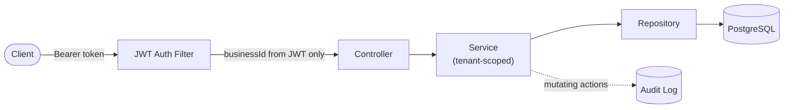

# ShiftSync

**Live:** [shiftsync-api-y3kb.onrender.com/docs](https://shiftsync-api-y3kb.onrender.com/docs) · 

I built this because I got tired of "portfolio projects" that are really just CRUD apps wearing a trench coat. ShiftSync is a shift-rostering backend for small hospitality and retail businesses — cafés, small retail chains, that kind of thing — and the whole point of building it was to actually wrestle with a problem most student projects skip entirely: what happens when one system has to serve *many* businesses at once, safely, without their data ever touching.

## The problem, as I understood it

Talk to anyone who's managed staff at a small café and you'll hear the same thing: scheduling happens in a group chat or a shared spreadsheet somewhere. It works, technically, until it doesn't — someone gets double-booked, nobody remembers who actually worked the public holiday shift, and there's no record of any of it if a dispute comes up. That's not a hypothetical; it's just how a lot of small operators run things because nothing better exists at their price point.

So ShiftSync is my attempt at building the thing that *should* exist — a real backend with the same concerns a company would actually have if they were shipping this: don't let Business A ever see Business B's staff, don't let a manager assign a double shift by accident, and keep a record of who did what, when.

## What's actually in here

- **Multi-tenancy that isn't an afterthought.** Every table tied to a business carries an explicit `business_id`, and I made every repository method require that ID as a parameter rather than relying on some implicit "current tenant" filter sitting quietly in the background. My reasoning: an implicit filter is exactly the kind of thing a future me (or someone else touching this code) forgets to apply to a new query six months from now. Explicit is slower to write and much harder to get wrong.
- **JWT auth**, access + refresh tokens, with the business ID baked directly into the token claims — so the backend never has to trust anything the client says about which business it belongs to.
- **Role-based access** — Owner, Manager, Staff — enforced at the method level, not just "checked somewhere in a controller and hoped for the best."
- **An actual audit trail.** Every meaningful action gets logged: who registered a business, who logged in, who got added or removed from staff.
- **Flyway** managing the schema, because hand-editing a production database is how you end up debugging at 2am.
- **Shift scheduling with real conflict detection** — you genuinely cannot double-book a staff member, the overlap check happens before anything touches the database, and shifts landing on a public holiday get flagged automatically (pulled from a live public holidays API, with a fallback if that API's ever down).

## Stack

Java 21, Spring Boot 3, Spring Security, PostgreSQL, Flyway, Docker, JWT via JJWT. Nothing exotic — I wanted to actually understand every piece, not chase whatever's trendy this month.

## How the pieces fit together



The one decision I'd actually defend in an interview if pushed: the `business_id` used anywhere in this system comes from exactly one place — the signed JWT. Never a request body, never a URL param, never anything the client hands over directly. That's the whole ballgame for tenant isolation. If you can't trust the client to say which tenant it is, and you shouldn't, then the token has to be the single source of truth for that.

## Running it yourself

You'll need Java 21, Docker, and Maven (or just use your IDE's bundled Maven, which is what I did most of the time).

```bash
# spin up Postgres
docker compose up -d

# run the app
./mvnw spring-boot:run
```

It'll be listening on `http://localhost:8080`. Swagger UI is at `/docs` if you want to poke around visually instead of writing curl commands.

## A quick taste

```bash
curl -X POST http://localhost:8080/api/v1/auth/register \
  -H "Content-Type: application/json" \
  -d '{
    "businessName": "Cafe Lulu",
    "slug": "cafe-lulu",
    "ownerFullName": "Your Name",
    "ownerEmail": "you@example.com",
    "password": "SuperSecret123"
  }'
```

You'll get back an access token and refresh token. From there you can create staff, assign shifts, and try (and fail) to double-book someone — that failure is the point, not a bug.

## Testing

11 tests, all green.

- `ShiftServiceTest` and `StaffServiceTest` — 8 unit tests covering the actual decisions the code makes: does it correctly reject an overlapping shift, does it correctly stop a manager from creating another manager, that kind of thing. Mocked dependencies, no database, fast.
- `AuthIntegrationTest` — 3 tests that spin up a real, disposable Postgres container via Testcontainers and run the whole registration/login flow against it for real. No mocks anywhere in this one. Small honest confession: getting Testcontainers working reliably on Windows/WSL2/Docker Desktop took genuinely longer than writing the actual feature it's testing — that specific rabbit hole is its own story, and it's exactly why I also set up CI (below), so the tests get proven on a clean Linux box every single push, not just on my one temperamental laptop.

## CI/CD

Every push to `main` triggers a GitHub Actions run: checkout, JDK 21, `mvn test`, then a build. You can watch it run in the Actions tab of this repo — it's the same test suite mentioned above, just running somewhere other than my machine, which turned out to matter more than I expected.

## It's actually deployed

Not just "runs on my laptop." It's live on Render, connected to a real Postgres instance, and you can hit it right now: **[shiftsync-api-y3kb.onrender.com/docs](https://shiftsync-api-y3kb.onrender.com/docs)**. It's on Render's free tier, so if nobody's touched it in a while the first request might take 30-60 seconds to wake back up — that's normal free-tier cold-start behavior, not something broken.

## Where this could go next

- A proper deployed pipeline with per-environment config instead of one Render service doing everything
- Award-rate/penalty-rate calculation beyond just flagging public holidays — actual pay differentials
- A frontend, at some point, if I want this to be something a non-technical café owner could actually use rather than something you talk to with curl

## Where it stands

This started as a portfolio project meant to prove I could design and ship something with real architectural thinking behind it, not just make CRUD endpoints look busy. At this point it's got working multi-tenant auth, real scheduling logic with genuine conflict detection, a tested and CI-verified codebase, and a live public deployment — which is further than I expected to get when I started. Still actively iterating on it, so if you're reading this a while after I wrote it, check the commit history for what's changed since.
